# chrome_capture_operate

基于 AI 与 Chrome 的 HTTP 请求抓包与固化脚本工具。

# 背景与目标

有时需要在网页上执行重复的操作——工单查询、提单、流转、导出数据等。人工一步步点下来，费时且容易出错。为了提高处理效率，本工具把这类"人工在网页中的操作"**固化为可重复执行的 Python 脚本**：人工操作一遍并抓包，把抓包记录交给 AI 生成脚本，之后手工一键执行或定时自动执行。

由 AI 根据人工操作简述分析浏览器真实发起的抓包数据生成脚本，即使目标网站没有 API 接口文档也能支持；操作结果准确，执行高效，成本低——只有脚本生成阶段需要使用 AI，脚本执行阶段不再需要 AI。

可用于安全验证——例如用脚本复现网页请求、验证接口在无登录态或篡改参数时的响应，辅助安全测试。

# 典型操作顺序

完整走一遍典型流程的顺序如下（第 3、4 步为按需使用的辅助能力，不需要可跳过）：

1. 启动 Python 服务并打开 Web 管理页面，按页面提示安装 Chrome 插件
2. 在 Chrome 插件中配置 Cookie 推送规则（默认"全部禁止"，需改为允许推送目标网站）
3. （按需）在插件中收藏需要长期打开的一批页面，之后一键批量打开
4. （按需）在插件中为需要保持登录态的网站配置会话保持，避免网页登录态失效
5. 通过 Python 应用页面启动用于抓包的 Chrome
6. 在用于抓包的 Chrome 中打开目标网站，把要固化的操作人工执行一遍
7. 在 Python 应用页面获得生成固化脚本的提示词，人工补全操作描述与具体要求后，提交给 AI 执行
8. 在日常使用的 Chrome 中登录目标网站，插件自动向 Python 服务推送 Cookie 供脚本使用
9. 在 Python 应用页面执行固化的 Python 脚本，验证运行效果
10. 在 Python 应用页面配置固化脚本的定时任务，实现定时自动执行

## 为什么不用现成的抓包工具

浏览器自带的开发者工具（F12）也能导出抓包数据（HAR 文件），为什么不直接用它？

| 现成工具的问题 | 说明 |
|---|---|
| **数据太臃肿，AI 看不过来** | HAR 文件里塞满了 AI 不需要的内容（SSL 握手耗时、每个请求 20 多项性能指标、转码后的二进制），一个普通页面轻松 5~20MB——AI 读不过来，还容易漏掉关键接口 |
| **生成的脚本没法维护** | 现有"HAR 转 Python"工具只能生成机械堆砌的请求重放代码：没有业务逻辑，改一个参数要改几十处，后续没法改 |
| **登录状态没法自动获取** | HAR 工具不解决"脚本运行时怎么拿到最新登录状态"的问题——Cookie 过期了，脚本就废了 |

## 相比RPA的优势

RPA（机器人流程自动化）工具同样面向"把网页操作自动化"，但实现思路完全不同：RPA 模拟人在界面上的点击和输入，本工具直接调用网站接口。

| 对比维度 | RPA 工具 | 本工具 |
|---|---|---|
| **怎么执行** | 模拟界面操作：鼠标点击、键盘输入、等页面加载出来 | 直接调用接口：脚本带上登录状态发起真实请求 |
| **执行速度** | 受页面加载和操作节奏限制，和人工点击差不多快 | 接口调用毫秒级，批量任务快几十倍 |
| **稳定性** | 靠页面元素的位置——网站改版、弹窗、页面加载慢都可能让流程卡住 | 不打开页面，界面怎么变都不影响 |
| **占用资源** | 要开着完整浏览器页面渲染 | 只发请求，没有界面开销 |
| **出了问题怎么查** | 要一步步回放当时的界面操作来定位 | 脚本是能直接读的代码，每次执行有完整日志 |
| **复杂需求** | 录制或拖拽搭建，复杂逻辑（条件判断、循环、出错重试）不好做 | 向 AI 描述需求生成代码，多复杂都能写 |

# 总体架构与工作原理

## 三个阶段的工作方式

| 阶段 | 使用的Chrome | 该Chrome的作用 | 是否需要Cookie | 人工需要做什么 | 阶段产出 |
|---|---|---|---|---|---|
| 抓包 | 新启动的抓包专用Chrome | 在其中人工操作目标网站，记录请求 | 不需要（需登录时人工在该Chrome中登录） | 在网页中把目标操作执行一遍 | 抓包记录文件 |
| 生成脚本 | 不需要 | — | 不需要 | 补充操作描述与具体要求，粘贴给AI | 固化Python脚本 |
| 执行脚本 | 日常使用的Chrome | 插件自动推送网站Cookie到长期运行的Python脚本 | 需要（从长期运行的Python脚本获取） | 无（可手工或定时自动执行） | 业务结果与执行日志 |

## 实现机制说明

- **Cookie 自动供给**：插件安装在日常使用的 Chrome 中，按启动 / Cookie 变更 / 定时三种时机自动推送 Cookie 到 Python 服务，推送范围可配置；Cookie 仅存内存不落盘。固化脚本运行时通过 HTTP 接口获取，始终拿到最新的登录态，无需人工复制 Cookie。
- **登录会话保持**：长时间不访问目标网站会导致登录会话过期，定时执行的脚本随之返回未登录。可配置插件按设定间隔定时刷新 Chrome 中已打开的目标网站页面，主动保持登录会话；仅当匹配的页面全部是当前活动标签页时才弹窗确认，避免打扰。
- **敏感信息脱敏**：抓包记录文件与服务日志中，Cookie、Authorization 的值均掩码处理（仅保留字段名），泄露风险受控。
- **执行保护（执行超时时间）**：固化脚本统一设置执行超时时间（默认 5 分钟，可配置）——手工执行超时后由人工决定是否终止，定时执行超时后自动终止，避免脚本卡死长期占用资源。
- **安全边界**：服务仅监听本机（127.0.0.1），不对外网暴露；Cookie 不落盘；服务启动时防止重复启动。

# 工具下载地址

[https://github.com/Adrninistrator/chrome_capture_operate](https://github.com/Adrninistrator/chrome_capture_operate)

[https://gitee.com/adrninistrator/chrome_capture_operate](https://gitee.com/adrninistrator/chrome_capture_operate)

# 使用说明

## 概述

整体工作流程由三方协作完成：

- **Chrome 插件**（安装在日常使用的 Chrome）：自动将浏览器 Cookie 推送给 Python 服务，让脚本以登录态发起请求
- **Python 服务**（本机后台运行）：驱动独立的抓包用 Chrome 抓取 HTTP 请求，管理抓包记录，执行固化脚本
- **AI**（人工调用）：读取抓包记录，按人工描述的操作流程生成固化 Python 脚本

典型工作流：**抓包 → 生成提示词 → 粘贴给 AI 生成脚本 → 手工或定时执行脚本**

Web 管理页面（`http://127.0.0.1:33445`）共八个标签页：

| 标签页 | 用途 |
|---|---|
| 抓包 | 启动抓包用 Chrome，开始/暂停/结束抓包，实时查看记录 |
| 抓包记录 | 管理历史抓包目录：搜索、清理、重命名、生成固化脚本提示词 |
| 快速执行脚本 | 手工执行固化脚本并查看输出 |
| 定时执行脚本 | 为固化脚本配置定时任务，查看执行日志 |
| 参数配置 | 修改监听端口、过滤清单、超时等参数 |
| Chrome Cookie接收状态 | 查看最近 50 次插件 Cookie 推送记录（含查看推送详情） |
| Chrome进程多开 | 管理多账号并用的独立Chrome实例 |
| 使用说明 | 查看工具的完整使用说明（即当前页面） |

数据交互简图：

```
抓包阶段（记录人工操作产生的请求）：
  日常Chrome ──打开──> Python服务网页
                          │ 启动抓包Chrome / 开始结束抓包 / 修改抓包配置
                          ▼
                     抓包专用Chrome ──人工操作目标网站，网络访问被记录──> 抓包记录文件

执行阶段（脚本自动执行）：
  日常Chrome ──插件自动推送Cookie──> Python服务（长期运行）
  固化脚本（手工/定时执行）──获取Cookie──> Python服务
  固化脚本 ──携带Cookie访问──> 目标网站
```

## 环境准备

### 操作系统要求

需要使用 Windows 操作系统

### 安装Python环境

需要先安装 **Python 3.10 或更高版本**（可从 Python 官网下载安装程序，安装时勾选加入 PATH）。

### 安装与启动Python服务

1. 进入 `chrome_capture_operate_python` 目录
2. 首次使用：运行 `install.bat`——创建运行环境并安装依赖，**只需执行一次**
3. 每次启动服务：运行 `start.bat`——启动后系统托盘出现图标
4. 服务默认监听 `http://127.0.0.1:33445`（仅本机；端口可在参数配置页修改，修改后需重启服务）
5. 双击托盘图标或右键"打开页面"进入 Web 管理界面；右键"退出"结束服务
6. 需要开机自动启动服务时，可在参数配置页开启**是否自动启动**

### 安装Chrome插件

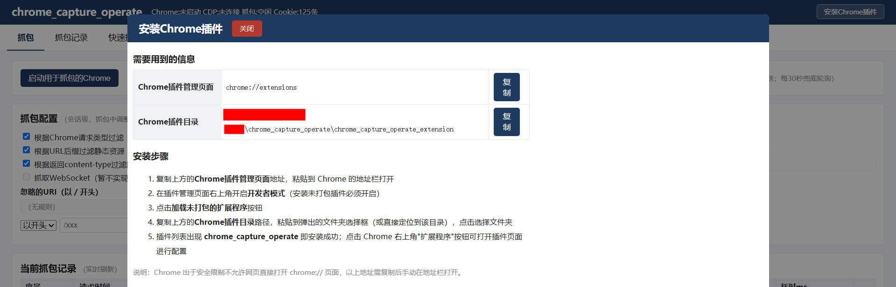

0. 快捷方式：点击页面右上角的**安装Chrome插件**按钮（所有标签页都可见）——打开安装说明窗口，其中展示 Chrome 插件管理页面地址与插件目录（各带**复制**按钮）及完整安装步骤；按窗口说明操作即可，也可按下面步骤手动操作
1. 在 Chrome 中打开扩展管理页面：地址栏输入 `chrome://extensions` 回车；或先打开 Chrome"设置"页面，再点击"扩展程序"
2. 右上角开启**开发者模式**，点击**加载未打包的扩展程序**，选择 `chrome_capture_operate_extension` 目录
3. 打开插件页面：点击 Chrome 右上角的**扩展程序**按钮，在出现的列表中点击**chrome_capture_operate**

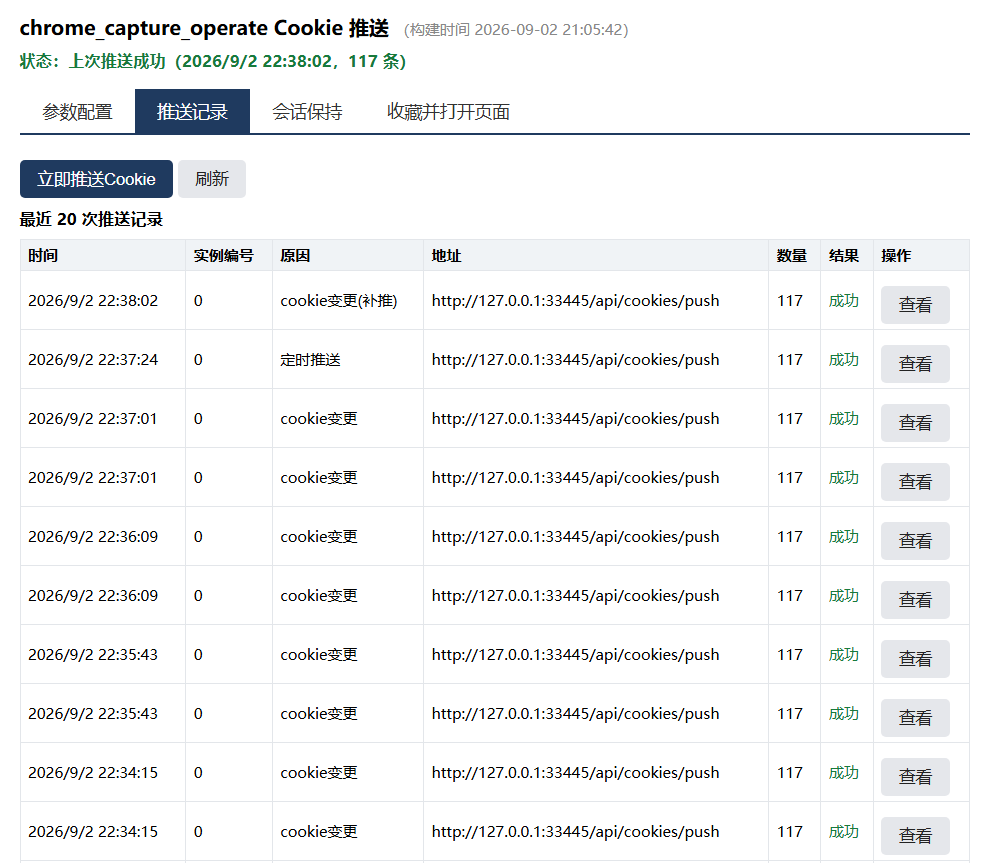
4. 在插件页面配置参数：
   - **推送目标地址**、**Cookie推送时间间隔**：通常不需要修改，保持默认值即可
   - **Cookie推送范围**：**必须按需修改**——默认为"全部禁止"，不会向 Python 服务推送任何 Cookie；需改为"全部允许"或"按指定范围推送"（允许与不允许清单，支持 `*.baidu.com` 通配符，不允许优先）
   - 不确定目标网站会访问哪些域名时，可先在抓包页的"需要抓包的网址"列表查看该浏览器实际访问过的域名
   - 插件另有会话保持与配置导入导出功能，见下一节
   - 多开场景（同一网站多个账号）：每个Chrome实例都要安装插件，并在插件设置页的"Chrome实例编号"中填写各自的实例编号

### Chrome插件的其他功能

#### 会话保持

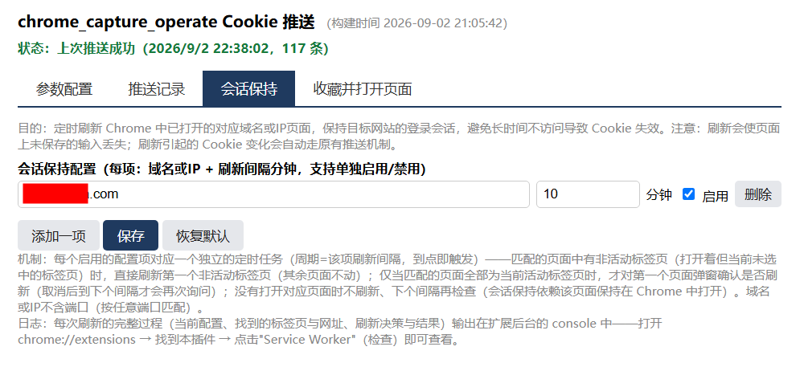

长时间不访问目标网站，登录会话会过期，定时执行的固化脚本随之返回未登录/401。插件可定时刷新 Chrome 中已打开的目标网站页面，主动保持登录会话。

- **配置入口**：插件页面的**会话保持**标签页
- **配置项**：每项 = 域名或IP（如 `www.baidu.com`、`127.0.0.1`，不含端口）+ 刷新间隔（分钟，最小 1）；支持配置多项，每项可单独启用/禁用
- **工作机制**：插件按每项配置的刷新间隔独立定时触发，Chrome 中打开了对应域名或IP的页面时刷新该页面：
  - 匹配的页面中有非活动标签页（打开着但当前未选中的标签页）时，直接刷新第一个非活动标签页，其余页面不动
  - 匹配的页面全部是当前活动标签页时，才对第一个页面弹窗确认是否刷新；取消后到下个间隔才会再次询问
  - 没有打开对应页面时不刷新、下个间隔再检查——**会话保持依赖对应页面保持在 Chrome 中打开**
- **注意**：刷新会使页面上未保存的输入丢失；刷新引起的 Cookie 变化自动走原有推送机制，无需人工干预
- **日志**：每次刷新的完整过程（当前配置、找到的标签页与网址、刷新决策与结果）输出在扩展后台的 console——打开 `chrome://extensions` → 找到本插件 → 点击**Service Worker**（检查）即可查看

#### 配置导入导出

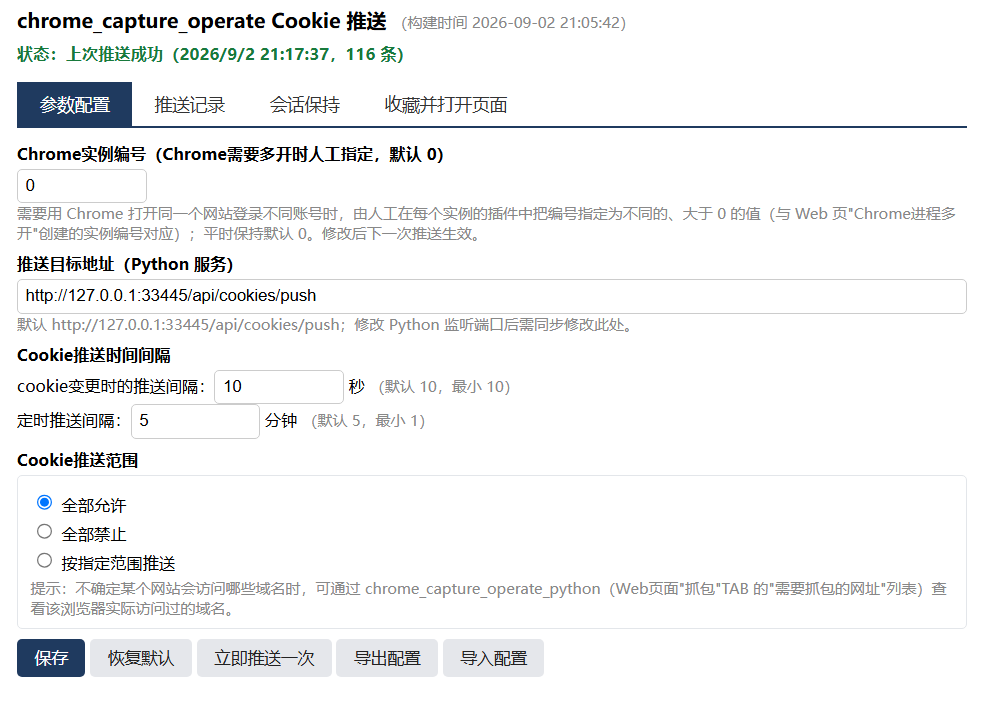

插件页面（**参数配置**标签页）支持将全部配置参数（推送目标地址、推送时间间隔、推送范围、会话保持配置等）**导出配置**为 `.json` 文件，以及从 `.json` 文件**导入配置**，便于在新机器或多浏览器间复制配置。导入立即生效；推送记录等历史数据不在导出范围。

#### 收藏并打开页面

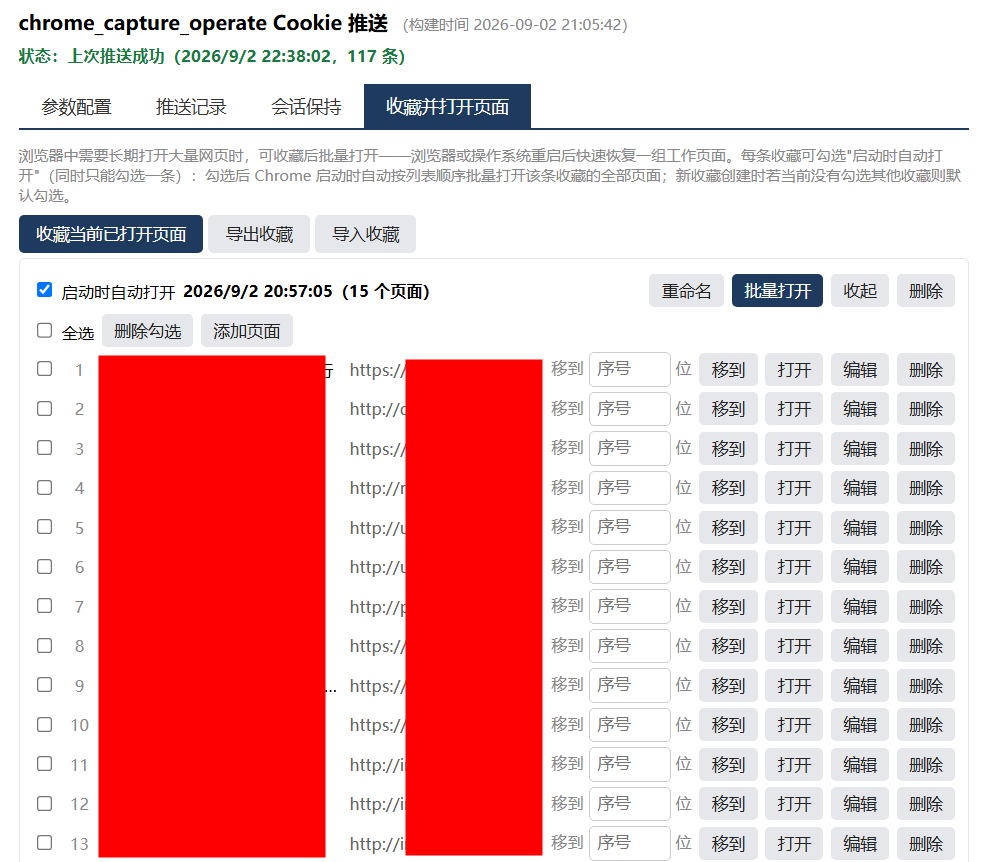

浏览器中需要长期打开大量网页时，可把当前打开的页面收藏为一条记录，之后一键批量打开——浏览器或操作系统重启后快速恢复整组工作页面。

- **收藏当前已打开页面**：在插件**收藏并打开页面**标签页点击按钮，把当前浏览器所有打开的网页收藏为一条新记录（记录每个页面的标题与地址）；本插件的设置页和新标签页等非网页不会收藏
- **重命名**：每条收藏显示名称（默认为收藏时间），点击**重命名**（或直接点名称）修改
- **查看与编辑**：点击某条收藏的**查看**展开页面列表（每行展示序号、标题与地址）——可单独**打开**某个页面、**编辑**页面的标题与地址、**删除**单个页面，也可勾选多个页面后**删除勾选**批量删除（页面全部删完后该条收藏自动删除；删除后列表保持展开）
- **添加页面**：展开收藏后点击**添加页面**，在列表末尾出现的输入行中填写标题与地址（同一行输入，回车或点击**添加**确认），向该条收藏追加一个页面
- **调整顺序**：每个页面在"移到 __ 位"输入框填目标序号后点**移到**（直接跳到该位置，回车亦可）——序号即批量打开时的先后顺序
- **批量打开**：点击某条收藏的**批量打开**，将全部页面按列表顺序依次打开（每个页面间隔约半秒，避免一次开太多）
- **Chrome启动时自动打开**：每条收藏可勾选**启动时自动打开**（同时只能勾选一条）——勾选后 Chrome 启动时自动按列表顺序批量打开该条收藏的全部页面（与手动批量打开相同，每个页面间隔约半秒）；新收藏创建时若当前没有勾选其他收藏则默认勾选；删除或删空该条收藏时勾选自动清除，导入收藏后需重新勾选（导入会重建记录）
- **删除整条收藏**：点击**删除**去掉不再需要的收藏记录
- **导入导出**：**导出收藏**将全部收藏记录保存为 `.json` 文件；**导入收藏**从 `.json` 文件恢复（整体替换现有收藏）。收藏数据保存在插件内（Chrome 的扩展存储）——**为避免移除插件等情况下数据丢失，建议将收藏的页面信息导出并保存**

## 参数配置（参数配置页）

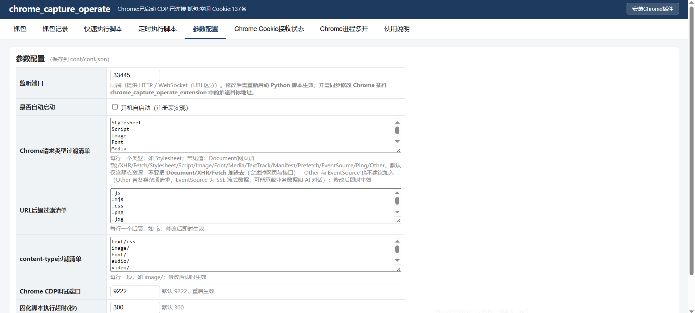

| 参数 | 默认值 | 说明与生效方式 |
|---|---|---|
| 监听端口 | 33445 | 修改后需**重启服务**生效；同时需**同步修改 Chrome 插件中的推送目标地址** |
| 是否自动启动 | 否 | 开机自启动（注册表实现），保存即生效 |
| Chrome请求类型过滤清单 | 纯静态资源 | 每行一个类型；**不要把 Document/XHR/Fetch 加进去**（会滤掉网页与接口请求）；修改后即时生效 |
| URL后缀过滤清单 | 常见静态资源后缀 | 每行一个后缀（如 `.js`）；修改后即时生效 |
| content-type过滤清单 | 常见静态资源类型 | 每行一项（如 `image/`）；修改后即时生效 |
| Chrome CDP调试端口 | 9222 | 抓包用 Chrome 的调试端口；重启服务生效 |
| 固化脚本执行超时(秒) | 300 | 手工/定时执行脚本的等待上限 |

修改后点击**保存**写入 `conf/conf.json`。

## 抓包流程

### 启动用于抓包的Chrome

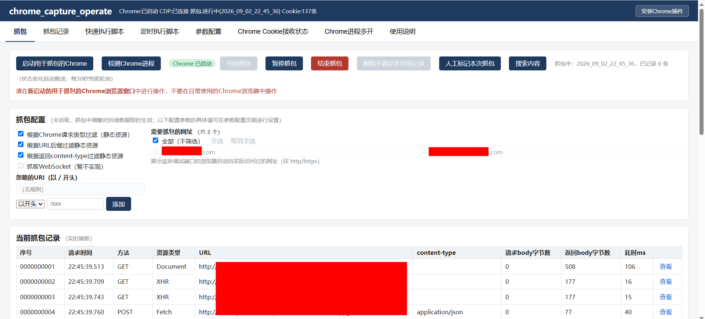

1. 在**抓包**页点击**启动用于抓包的Chrome**：服务会启动一个新的 Chrome 实例，使用独立的浏览器数据目录，与日常使用的 Chrome 互不影响
2. **务必在新启动的这个 Chrome 窗口中操作**（页面有提示），不要在日常 Chrome 中操作——抓包只记录这个新启动的 Chrome
3. 该 Chrome 启动后可**长期使用**，其中所有页面（含之后新打开的标签页）的网络访问都可被抓包
4. 已启动则不重复启动；状态变化自动推送到页面（如 Chrome 启动/结束），另有定时兜底检测，也可点**检测Chrome进程**立即检测

### 开始与控制抓包

1. 点击**开始抓包**：之后在该 Chrome 中的所有网络访问都会保存到 `captured_record/<时间目录>/`
2. 抓包中可随时调整抓包配置（会话级，重启后恢复默认），对后续数据即时生效：
   - **过滤开关**：按 Chrome 请求类型 / URL 后缀 / 返回 content-type 过滤静态资源
   - **需要抓包的网址**：默认全部，可勾选只抓指定域名
   - **忽略的URI**：按 以开头/等于/包含/以结尾 规则忽略指定路径
3. **暂停抓包/继续抓包**共用一个按钮（记录保留）；**结束抓包**结束本次会话并清空页面展示的记录
4. 需要提供给 AI 使用的记录，点击**人工标记本次抓包**（结束后目录名会加"_人工标记"后缀）
5. 开始抓包时的提示：建议在打开对应页面前开始抓包，或从登录对应网站开始抓包，以避免重要操作被漏掉
6. 当用于抓包的 Chrome 进程结束时，会自动结束本次抓包

### 查看与管理抓包记录

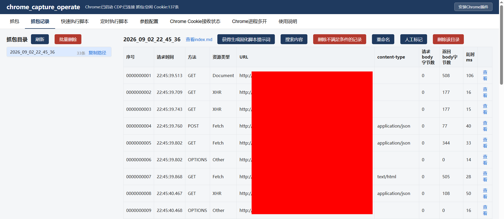

- 抓包中页面实时展示记录列表，单击行或**查看**按钮弹窗查看请求与返回（上下分区、语法高亮、可复制头/body/头+body）
- **搜索内容**：按关键字在请求/返回的头/body 中搜索（支持中文），结果列表标注命中部分，点击查看
- **删除不满足条件的记录**：抓包页与抓包记录页都支持——抓包页按当前抓包配置删除（页面与文件同步删除，完成后提示删除与保留的记录数量）；抓包记录页按过滤条件删除，可预览删除效果
- **抓包记录**页管理历史目录：查看文件列表、人工标记/取消标记、重命名、批量删除
- 每个抓包目录含 `index.md` 汇总（序号/时间/URL/方法/content-type/字节数/耗时）与按序号命名的明细文件

#### 功能实际使用场景

以下功能均**按需使用**，不使用这些功能也不影响"抓包 → 生成提示词 → 粘贴给 AI"的基本流程——把抓包目录直接交给 AI 生成脚本即可；仅在遇到对应场景时才需要使用。

- **搜索内容**：一次抓包往往产生上百条记录，肉眼逐条翻看效率很低。按关键字（URL、业务单号、返回值，支持中文）快速定位目标请求，主要用于确认关注的数据是否有被抓包到、通过哪个地址访问等；也常用于在返回中查找某个值是哪个接口带回来的
- **验证抓包域名是否足够**：生成脚本前，用业务关键字搜索请求与返回，若命中记录所属域名不在已勾选的抓包网址中，说明域名选择有遗漏需补充抓包；全部命中则范围足够
- **复制头/body**：把某条请求的头、body 或头+body 复制出来，粘贴给 AI 作为补充说明（比截图更精确），或粘贴到其他工具中调试对比
- **人工标记**：便于后续人工判断哪些目录的抓包内容是需要使用的（生成提示词时优先选择带标记的目录，避免无关记录干扰 AI）
- **删除不满足条件的记录**：目录中混入大量静态资源或无关域名请求时，按域名/URI 规则删除（可预览删除效果）再生成提示词——提示词更精简，AI 生成的脚本也更准确
- **批量删除/重命名**：定期清理不再需要的历史抓包目录释放磁盘空间；把保留的目录改成有意义的名字（如"下单流程-0828"）便于识别

## 通过AI生成固化脚本

### 获得生成固化脚本提示词

1. 前置：先在**快速执行脚本**页完成**配置固化脚本保存目录**（见下节），否则点击按钮会提示先配置
2. 在**抓包记录**页选中某个子目录，点击**获得生成固化脚本提示词**
3. **必须人工补全提示词内容**，否则 AI 缺少关键上下文：
   - **人工在网页的操作描述**：进行了什么操作、页面上有哪些重要的值
   - **生成Python脚本具体要求**：脚本要执行什么功能、是否有入参、执行逻辑
4. 点击**复制**将完整提示词复制到剪贴板，粘贴给 AI（如 Claude Code 等大模型工具）
5. 提示词已内置数据来源要求：脚本请求中使用的数据需来自用户指定的值或网站查询接口获取、尽量不硬编码；若 AI 提示某些参数值无法确定来源，说明抓包内容缺少获取对应数据的请求，需补充抓包对应操作后再生成

### 脚本生成结果

AI 会按提示词在配置的保存目录下生成一个子目录（名称由 AI 按内容生成），含三个文件：

- **Python脚本**（如 `main.py`）：固化脚本本体，运行时通过 HTTP 接口获取 Cookie 后重放请求
- **README.md**：脚本的作用与使用说明
- **prompt.md**：本次使用的完整提示词（追溯生成依据）

## 执行固化脚本

### 手工执行（快速执行脚本页）

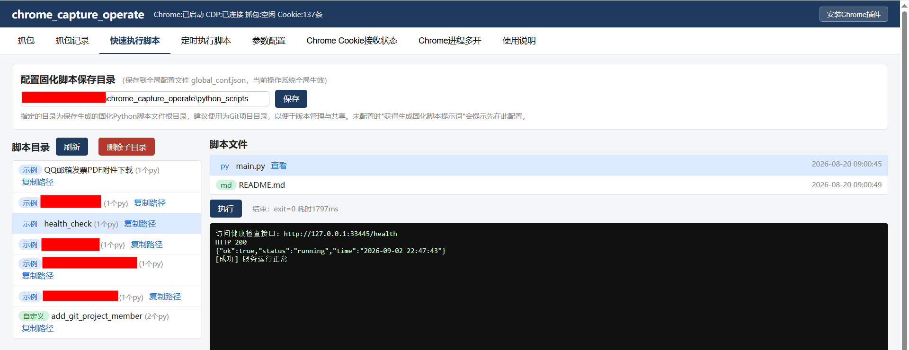

1. 左侧列表选择脚本子目录（示例目录 `python_scripts_example` 与自定义目录下的脚本均可执行），右侧展示其 `.py`/`.md` 文件（含最近修改时间，可查看内容）
2. 单个 `.py` 直接点**执行**；多个 `.py` 先选中再执行
3. 页面实时展示脚本运行时打印的输出内容（含报错信息）
4. 超过参数配置的执行超时时间（默认 5 分钟）未完成则提示执行超时，可点击**结束进程**强制终止
5. 支持复制子目录完整路径、删除子目录
6. 首次使用建议先执行示例目录的 `health_check` 验证脚本，确认整条链路可用

### 定时执行（定时执行脚本页）

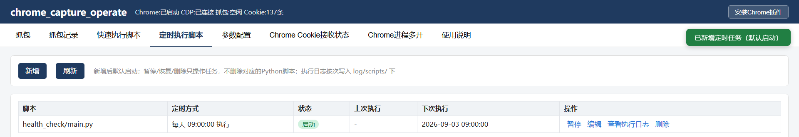

1. **新增**任务：选择一个固化脚本，配置两种定时方式之一：
   - **在指定时间执行**：每天 / 每周指定星期几 / 每月指定日期 + 多个具体时:分:秒
   - **每隔一段时间执行**：从指定时间开始，每隔一段时间执行一次（可配置允许执行的时间段，支持多个时间段）
2. 新增后默认启动；支持**暂停** / **恢复** / **编辑** / **删除**（删除任务不删除脚本）
3. **查看执行日志**：每次执行生成独立日志文件（`log/scripts/<脚本子目录>/<年份>/<脚本名>_<执行时间>.log`），支持按日期筛选、复制日志文件路径
4. 服务重启后任务自动恢复，重启期间错过的调度不补跑

## 场景示例

### 从QQ邮箱下载发票pdf附件

这是一个已用本工具生成的真实脚本，体现工具的实际作用：**从 QQ 邮箱一键批量下载发票 PDF 附件到本地，全程无需人工操作**。

**脚本做什么**

- 自动搜索收件箱中含"发票"的邮件，批量下载其中的 PDF 附件（多附件时只下文件名含"发票/报销"的，自动跳过"行程单"类文件）
- 从新到旧逐封处理，**遇到上次已处理过的邮件（已读）即自动结束**——每次运行只处理新收到的发票邮件，不重复下载
- PDF 统一保存到桌面按时间命名的子目录，并生成一份下载汇总（含漏检提示：有 PDF 但标题不含关键字的邮件、正文带发票链接的邮件）

**怎么用**

- **手动**：在**快速执行脚本**页选中该脚本点**执行**，等输出结束即可去桌面取文件
- **定时**：在**定时执行脚本**页配置**在指定时间执行**（如每月 1 号上午 9 点——按月报销/对账场景，固定日期跑一次），到点自动下载上月收到的全部发票附件到桌面，无需任何人工操作

**前提：Cookie 推送设置**（脚本以登录态访问邮箱，依赖插件推送 Cookie）

1. 日常 Chrome 已登录 QQ 邮箱，插件已安装
2. 插件**Cookie推送范围**需允许推送（改为"全部允许"，或"按指定范围推送"并在允许清单加 `*.mail.qq.com`）

该脚本在示例目录 `python_scripts_example/QQ邮箱发票PDF附件下载` 中；按上述 Cookie 推送设置完成后即可执行体验，也可按「通过AI生成固化脚本」的流程，针对自己的邮箱重新生成一个。

## Chrome Cookie接收状态

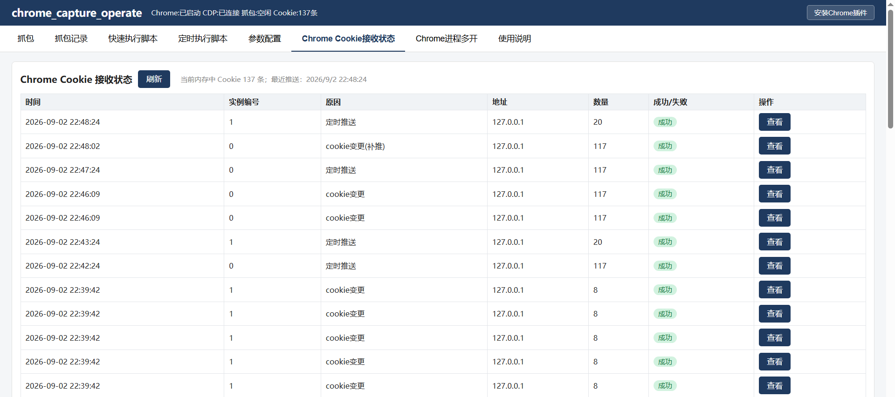

- **接收记录**：展示最近 50 次插件 Cookie 推送（Chrome实例编号/时间/原因/地址/数量/成功/失败），与插件"推送记录"TAB 展示的内容一致；页面顶部显示当前内存中的 Cookie 总数与最近推送时间
- **查看推送详情**：点击某条记录的**查看**展开详情——实例编号、Cookie数量、**Cookie对应的地址（域名或IP）**与 Cookie key，用于确认某次推送覆盖了哪些网站、是否包含目标网站的会话 Cookie
- **数量为 0 提醒**：接收到数量为 0 的推送时页面弹出红色提醒（可能是插件推送范围为"全部禁止"或勾选了对应实例编号）
- 排查 Cookie 获取失败时的完整检查步骤见「常见问题」表

## Chrome进程多开

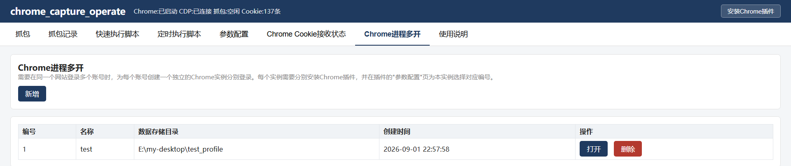

需要在同一个网站登录多个账号时（如管理多个账号的工单/邮箱），为每个账号创建一个独立的 Chrome 实例分别登录——各实例的数据互不干扰，固化脚本可按实例编号取用对应账号的 Cookie。

- **新增**：在**Chrome进程多开**页点击**新增**，输入名称（用于区分，如"账号A"）与本地数据存储目录的完整路径（目录需已存在，保存该实例的浏览器数据）
- **列表与操作**：展示编号/名称/数据存储目录/创建时间；**打开**启动该实例的 Chrome（首次自动拷贝收藏夹/访问历史/用户名）；**删除**去掉记录（保留 Chrome profile 目录及文件，本地数据存储目录不受影响，之后可在新增时重新指向该目录复用）
- **插件安装与编号设置**：在该 Chrome 中按"安装Chrome插件"步骤安装本工具插件（每个实例都要安装），然后在插件**参数配置**页的"**Chrome实例编号**"中填写该实例的编号（默认 0，多账号场景改为对应的、大于 0 的编号，与 Web 页列表中的编号对应；修改后下一次推送生效）
- 该 Chrome 之后直接登录账号即可，Cookie 推送自动归到对应实例编号
- 固化脚本获取指定账号的 Cookie：查询接口带 `profile` 参数（见 `api/api.md`）；不带则查所有实例

## 数据与文件位置

| 位置 | 内容 |
|---|---|
| `chrome_capture_operate_python\captured_record\` | 抓包记录（每次抓包一个时间命名子目录） |
| `chrome_capture_operate_python\python_scripts_example\` | 示例固化脚本目录（随项目分发） |
| 自定义固化脚本目录 | 在快速执行脚本页配置，建议 Git 项目目录便于版本管理与共享 |
| `chrome_capture_operate_python\log\` | 服务日志（每天一个文件） |
| `chrome_capture_operate_python\log\scripts\` | 定时执行脚本日志 |
| `C:\Users\%username%\.chrome_capture_operate\global_conf.json` | 全局配置：固化脚本保存目录、定时执行任务 |

## 常见问题

| 现象 | 排查 |
|---|---|
| 页面打不开 / 脚本获取 Cookie 报"服务不可达" | 服务未启动——运行 start.bat 或检查托盘图标；确认端口与参数配置一致 |
| 脚本执行提示未获取到 Cookie / 报"当前没有任何 Cookie" | 依次检查：Chrome 插件是否已安装；插件推送范围是否已从"全部禁止"改为其他模式；在"Chrome Cookie接收状态"页查看是否有接收记录；点击**查看**可展开该次推送的Cookie对应的地址（域名或IP）、Cookie数量与Cookie的key——若无记录说明插件未推送，可打开插件页面点击**立即推送一次**人工推送 |
| 脚本执行返回未登录 / 401 | 在"Chrome Cookie接收状态"页确认插件已推送且包含会话 Cookie；确认登录态与插件在同一个 Chrome 浏览器进程中；推送范围 allow 清单写 `*.example.com`（带 `*.`）才能命中裸域与全部子域；推送正常仍 401 多为会话过期——在插件**会话保持**标签页配置定时刷新对应网站页面（见「Chrome插件的其他功能」一节） |
| 开始抓包提示需先启动 Chrome | 先点**启动用于抓包的Chrome**；若已启动但检测不到，点**检测Chrome进程**刷新 |
| 抓不到目标请求 | 检查抓包配置的过滤开关/网址选择/URI忽略规则是否误杀；查看记录的"资源类型"列确认未被类型过滤；注意仅记录 http/https 流量 |
| 生成提示词时提示需配置脚本保存目录 | 在"快速执行脚本"页的**配置固化脚本保存目录**填写并保存（建议 Git 项目目录） |
| 脚本执行超时 | 在参数配置页调整"固化脚本执行超时"；或检查脚本是否在等待交互输入 |
| 定时任务到点未执行 | 确认任务未被暂停；服务重启后任务自动恢复，但重启期间错过的调度不补跑 |

# 已知限制

- 不支持 WebSocket 协议抓包（页面开关禁用，暂不实现）
- 仅记录 http/https 流量；浏览器内部请求不进入网址列表与抓包记录
- 新标签页打开瞬间的极少量请求可能漏抓
- 抓包 Chrome 的浏览器数据目录位于系统 temp 目录，可能被系统清理；清理后重新点击**启动用于抓包的Chrome**即可（会重建数据目录并重新拷贝日常 Chrome 的收藏夹/历史/用户名）。**抓包记录不受影响**——保存在项目目录的 `captured_record` 中，不会被清理
- Cookie 变更推送存在节流（最短 10 秒），实际推送时间可能略晚于变更
