# 背景与目标

有时需要在网页上执行重复的操作——工单查询、提单、流转、导出数据等。使用本工具能够将这类“人工在网页中的操作”**生成为可重复执行的 Python 脚本**，提高处理效率。

可由 AI 或人工在浏览器执行操作并抓包，由 AI 分析并生成脚本。**人工或AI在前端操作过程中页面上的每一步（点击、填写值、提交等）的事件自动留痕，与网络访问抓包数据通过时间确定执行顺序与含义**，AI 可以准确地生成脚本。

即使目标网站没有接口文档也能支持；生成的脚本基于抓包实测数据编写，执行结果准确、执行高效、成本低，只有脚本生成阶段需要使用 AI，脚本执行阶段不再需要 AI。

可用于生成Web应用接口自动化测试脚本，也可用于安全验证，例如用脚本复现网页请求、验证接口在无登录态或篡改参数时的响应，辅助安全测试。

一句话总结：**由人工或AI自主进行网页操作，后台自动记录毫秒级对齐的前端操作与网络访问数据，使AI基于以上数据生成可重复执行的 Python 脚本。无需接口文档，脚本执行阶段也不再需要 AI。**

# 实现的功能与特点

- **抓包**：提供将Chrome浏览器网络数据抓包生成本地文件的功能，分为索引文件与每次访问的HTTP/HTTPS协议数据文件，对LLM分析友好；支持根据请求类型与访问地址进行过滤，排除干扰数据；提供MCP工具，使AI Agent能够控制抓包

- **前端页面操作自动记录**：点击、输入值、勾选、下拉选择、提交、路由变化等与请求时间线毫秒级对齐，AI不需要靠时间戳猜测哪个请求对应哪次操作；页面刷新后持续记录，密码自动掩码，记录的事件类型可配置

- **提供网站Cookie**：通过Chrome插件与Python应用将Chrome网站的Cookie与Authorization开放为本地HTTP接口（日常Chrome经插件推送，用于抓包的Chrome经CDP实时读取），Chrome插件支持控制需要推送Cookie与Authorization的网站范围，支持网站会话保持；Cookie查询请求逐次留痕到独立日志文件（每天滚动，仅记数量与key），便于安全审计；Chrome插件支持通过程序自动安装，便于非技术人员使用

- **执行脚本**：生成的脚本可通过Python应用快速执行、定时自动执行、系统托盘执行、手工执行，或由AI Agent或其他程序执行；也提供MCP工具供AI Agent调用

# 工具获取与结构

[https://github.com/Adrninistrator/chrome_capture_operate](https://github.com/Adrninistrator/chrome_capture_operate)

[https://gitee.com/adrninistrator/chrome_capture_operate](https://gitee.com/adrninistrator/chrome_capture_operate)

chrome_capture_operate_extension目录为Chrome插件，chrome_capture_operate_python目录为Python应用

# 实现机制说明

## Chrome网络数据抓包

Python 应用启动专用于抓包的 Chrome，该 Chrome 中的网络访问被保存为本地文件：索引文件汇总全部记录并标注各接口首次出现的记录，每次访问单独一个明细文件，内容为重建的完整 HTTP/HTTPS 请求与返回数据，对 LLM 分析友好；抓包期间可记录操作注释，与请求时间对齐保存，便于对齐前端操作与请求；支持按请求类型与网址过滤，排除静态资源等干扰数据。开始抓包时开启“记录前端页面操作”后，向页面注入 DOM 事件监听，自动记录前端操作（点击、填写值、勾选、下拉选择、提交、回车提交、SPA 路由变化等）到统一时间线，页面刷新或跳转后持续记录，密码自动掩码，人工操作与 AI 操作均留痕并区分，记录的事件类型可在“参数配置”标签页选择。

## Chrome Cookie、Authorization提供

分为两个来源，均通过本地 HTTP 接口获取，无需人工复制 Cookie：

- 日常 Chrome：插件安装在日常使用的 Chrome 中，按启动 / Cookie 与 Authorization 变更 / 定时三种时机，把推送范围内的 Cookie 与 Authorization 推送到 Python 服务，仅存内存不落盘；推送范围在插件中配置
- 用于抓包的 Chrome：Python 服务经 CDP 实时读取内存中的 Cookie（含 httpOnly 与分区 Cookie），Authorization 在抓包期间观察请求头缓存；仅内存传递，不保存到文件

由 AI 分析并生成脚本时，可用 Cookie 发起实际请求进行验证；抓包文件中的 Cookie、Authorization 均已掩码，可从用于抓包的 Chrome 的接口获取。

## AI生成操作脚本

LLM根据Chrome抓包数据，结合人工提供的操作与重要数据描述，或者AI Agent调用chrome-devtools-mcp获得的前端页面分析，就能够生成准确的Python脚本。

# 各阶段实现方式

从整体上看，可以分为生成脚本与执行脚本的阶段，可以在不同的电脑完成。

## 生成脚本

|阶段|实现方式|
|---|---|
|在抓包浏览器登录目标网站|用户人工登录|
|在抓包浏览器执行需要生成脚本的操作|1. 用户人工操作<br>2. AI Agent通过chrome-devtools-mcp等方式自主操作|
|获取前端页面操作事件|本工程的chrome_capture_operate_python项目通过CDP获得用于抓包的Chrome的前端操作事件（点击、填写值、提交等），并与网络访问数据保存为统一时间线|
|前端网络访问数据抓包|本工程的chrome_capture_operate_python项目通过CDP获得用于抓包的Chrome的网络访问数据并保存为文件|
|分析并生成脚本|AI Agent根据抓包数据等分析生成|

人工操作方式的整体流程如下图：

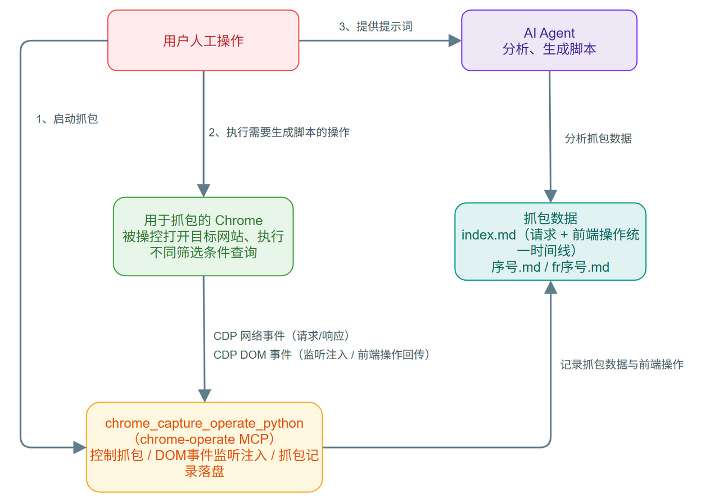

AI 自主操作方式的整体流程如下图：

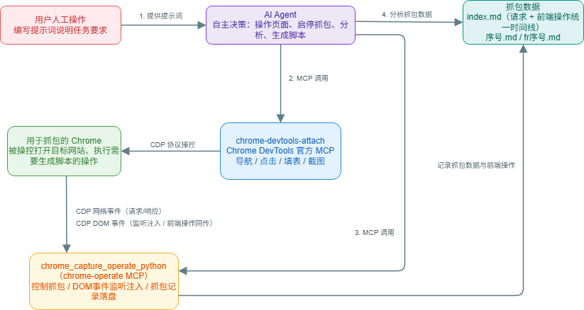

## 执行脚本

|阶段|实现方式|
|---|---|
|获取日常使用浏览器Cookie|本工程的chrome_capture_operate_extension项目，以Chrome插件形式获取|
|通过接口提供浏览器Cookie|本工程的chrome_capture_operate_python项目，接收以上Chrome插件提供的，并对外提供获取接口|
|执行脚本|1. 通过本工程的chrome_capture_operate_python项目快速执行或定时执行<br>2. 由AI Agent或其他程序执行<br>3. 用户人工执行|

执行生成的脚本，整体流程如下图：

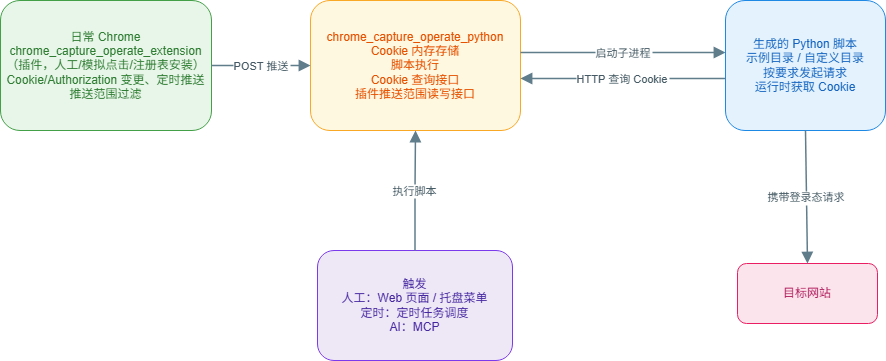

# 典型操作顺序

典型操作顺序分三种情况：AI自主操作生成脚本、人工操作生成脚本、执行

## AI自主操作生成脚本

1. 安装公共依赖与 AI 自主模式的依赖（nodejs、chrome-devtools-mcp）
2. 在需要使用的 AI Agent 中配置 MCP chrome-devtools-attach、chrome-operate
3. 通过 Python 应用页面页头**AI自主操作Chrome**弹窗启动用于抓包的 Chrome，在其中打开并登录需要生成脚本的网站
4. 编辑提示词模板，补充需要 AI 在前端页面执行哪些操作、需要生成的 Python 脚本的具体要求，提交给 AI Agent 执行，等待 AI 分析并生成脚本（开始抓包时开启注入后，AI 的页面操作也自动留痕；结束后 AI 可把本次会话目录重命名为便于理解的名字——时间戳后追加描述并附人工标记后缀，如 2026_09_28_17_05_48_查询工单列表_人工标记，便于在**抓包记录**标签页识别每次抓包的内容）

## 人工操作生成脚本

1. 通过 Python 应用页面启动用于抓包的 Chrome，在其中打开目标网站，抓包并执行需要生成脚本的操作——**你做的每一步操作（点击、填写、提交）与填写的值会自动记录在抓包数据中，页面刷新后也不会漏**
2. 在 Python 应用页面获得生成脚本的提示词，人工补全操作描述与具体要求后，提交给 AI Agent 执行，等待 AI 分析并生成脚本

## 执行

1. 在日常使用的 Chrome 安装插件并配置 Cookie、Authorization 推送规则，登录需要操作的网站
2. 在 Python 应用页面执行生成的 Python 脚本，或配置为定时自动执行

# 使用说明

## 依赖环境

- 操作系统：Windows 10 或 Windows 11
- Chrome 浏览器（需要较新的版本）
- Python 3.10 或更高版本

## 安装步骤-AI安装

假如不想人工逐项安装，可将项目根目录下的“提供给AI的安装说明.md”文件路径提供给 AI Agent（如 Claude Code），AI Agent 读取后会按文档指引完成全部安装步骤，包括 Chrome 浏览器插件的安装与配置。

## 安装步骤-人工安装

### 公共依赖

#### 安装Chrome

从 Chrome 官网下载安装包并安装（需要较新的版本）。

#### 安装Python

从 Python 官网下载 **Python 3.10 或更高版本**的安装包，安装时勾选加入 PATH 环境变量。

#### 下载当前项目

从 GitHub 或 Gitee 下载本项目。

#### 安装并启动Python服务

1. 进入 `chrome_capture_operate_python` 目录
2. 首次使用：运行 `install.bat`——创建运行环境并安装依赖，**只需执行一次**
3. 每次启动服务：运行 `start.bat`——启动后系统托盘出现图标，服务自动用 Chrome 打开 Web 管理页面
4. 双击托盘图标或右键**打开页面**可再次进入 Web 管理页面，右键**退出**结束服务
5. 可在网页中配置Python应用为自启动

Web 页面的**参数配置**标签页如下：

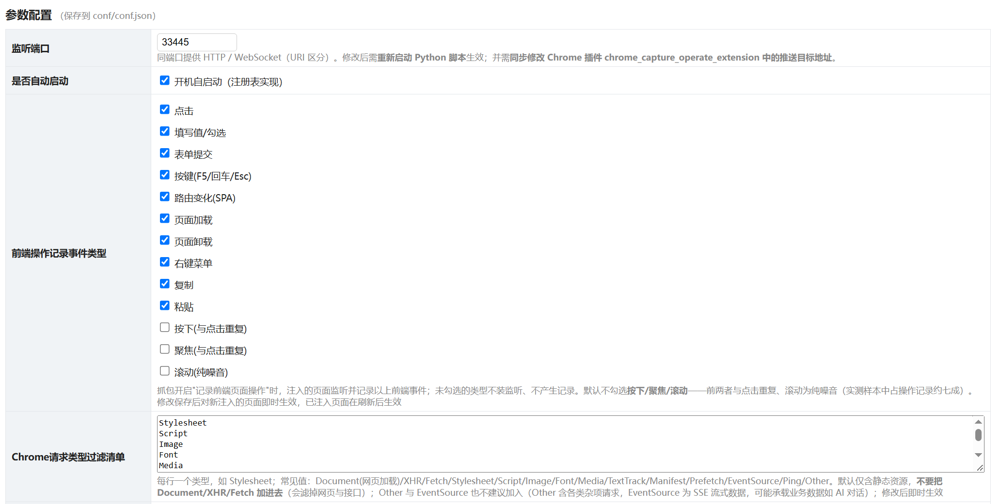

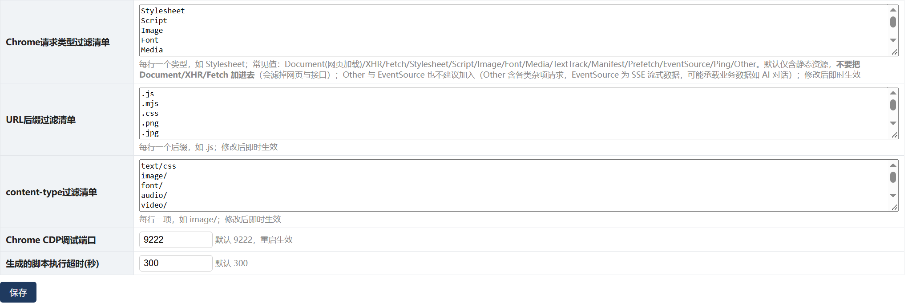

### 执行脚本

假如需要执行生成的脚本，则需要执行以下安装操作

#### 安装Chrome插件

点击页头**安装Chrome插件-人工**按钮查看人工安装步骤，或点击**安装Chrome插件-自动**按钮使用模拟点击安装（推荐）或注册表安装。

自动安装Chrome插件截图如下：

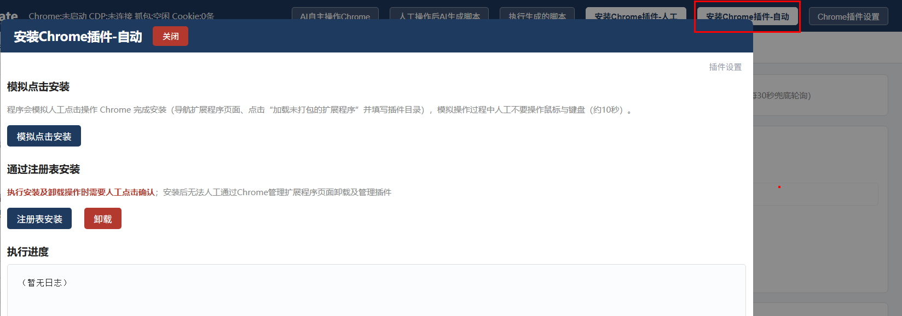

人工安装Chrome插件截图如下：

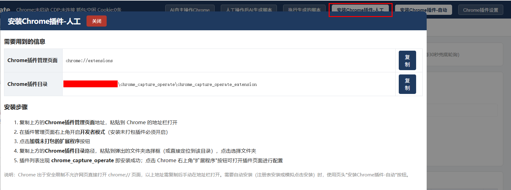

人工安装步骤（按钮弹窗中有同样的说明，复制按钮可直接复制对应内容）：

1. 点击弹窗第一个**复制**按钮（Chrome插件管理页面地址），在 Chrome 地址栏粘贴后回车，打开 Chrome 扩展程序页面

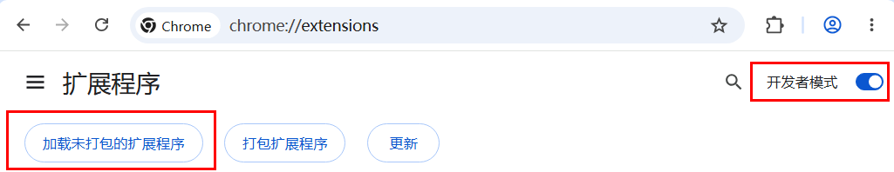

2. 点击弹窗第二个**复制**按钮（Chrome插件目录），在扩展程序页面右上角开启**开发者模式**，点击**加载未打包的扩展程序**，在文件夹选择框中粘贴刚复制的地址，点击**选择文件夹**

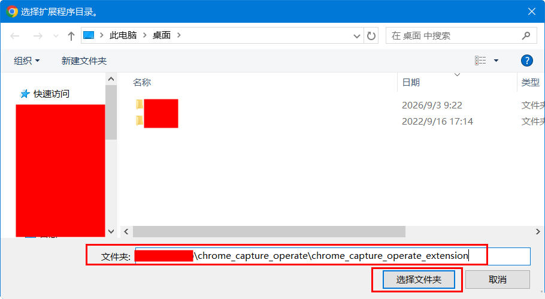

3. 安装完毕后扩展程序页面会出现 chrome_capture_operate

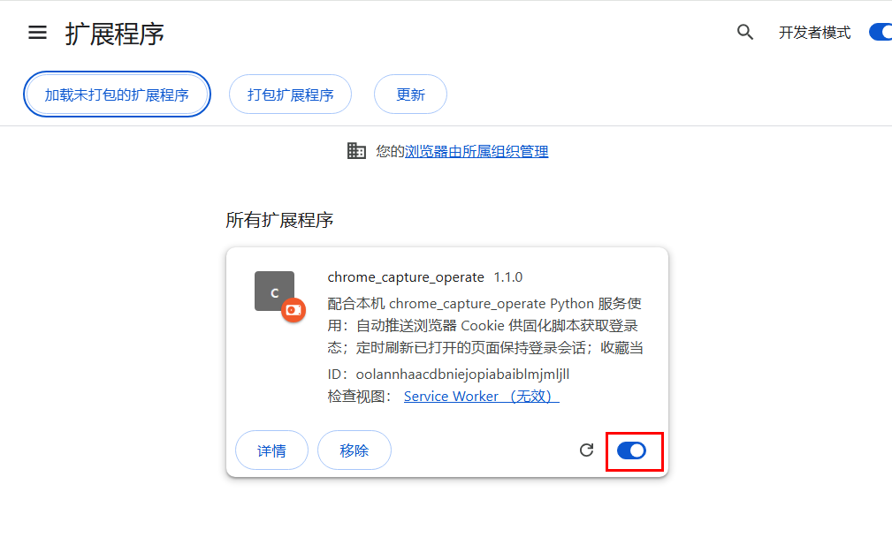

4. 打开插件页面：点击 Chrome 右上角的**扩展程序**按钮，点击 **chrome_capture_operate**

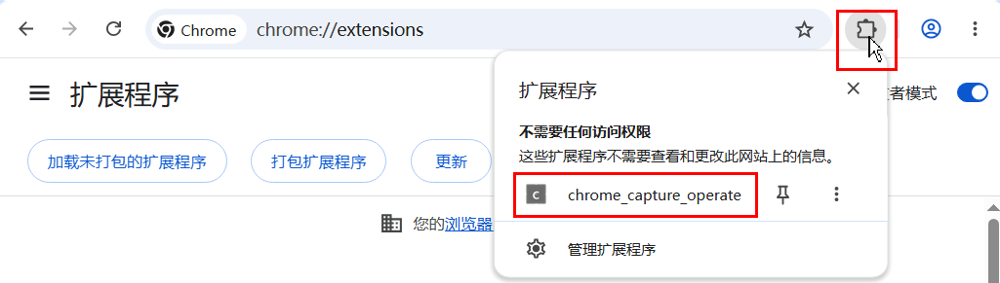

#### Chrome插件配置

打开插件页面：点击页头**Chrome插件设置**按钮（仅已安装插件时支持打开，未安装时会提示），或点击 Chrome 右上角**扩展程序**按钮下的 **chrome_capture_operate**。

页头的“Chrome插件设置”按钮如下：

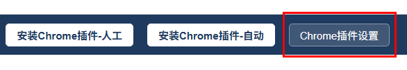

Chrome 右上角“扩展程序”按钮下的“chrome_capture_operate”如下：

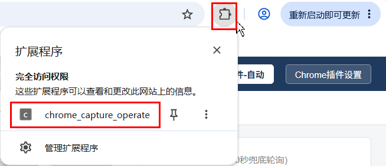

Chrome插件参数配置页面如下：

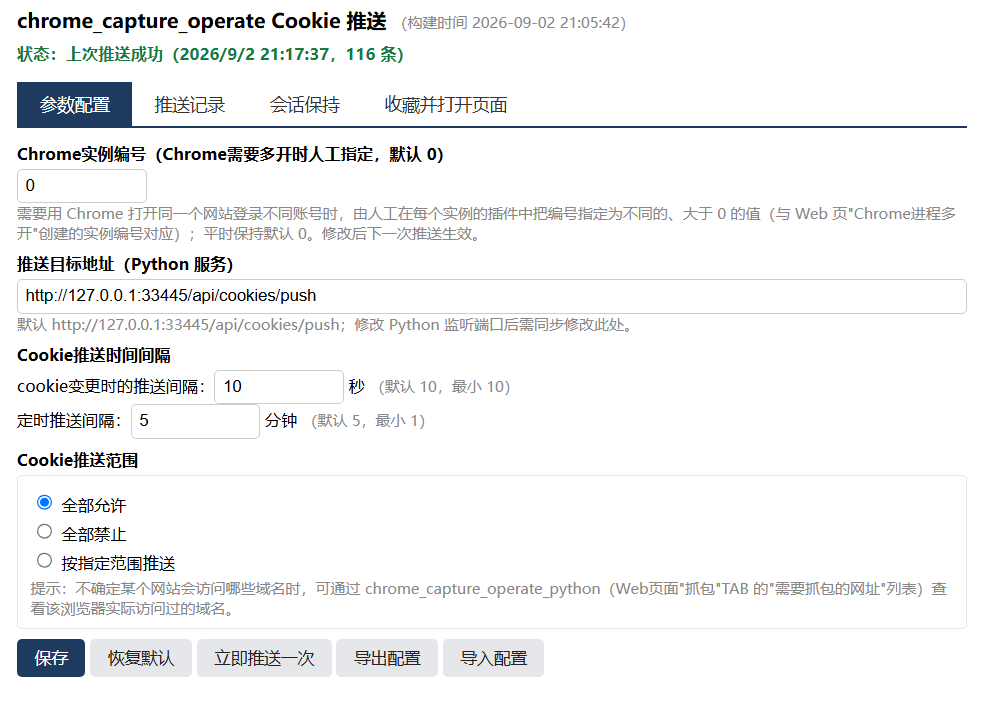

- **必须配置Cookie推送范围**：默认“全部禁止”，插件不会向 Python 服务推送任何 Cookie，所有脚本无法获取登录态，执行时返回未登录/401；需改为“全部允许”，或“按指定范围推送”（允许清单支持 `*.example.com` 通配符）
- 不确定目标网站会访问哪些域名时，可先在**抓包**标签页的“需要抓包的网址”列表查看该浏览器实际访问过的域名
- 多账号场景：每个 Chrome 实例在插件**参数配置**标签页填写各自实例编号

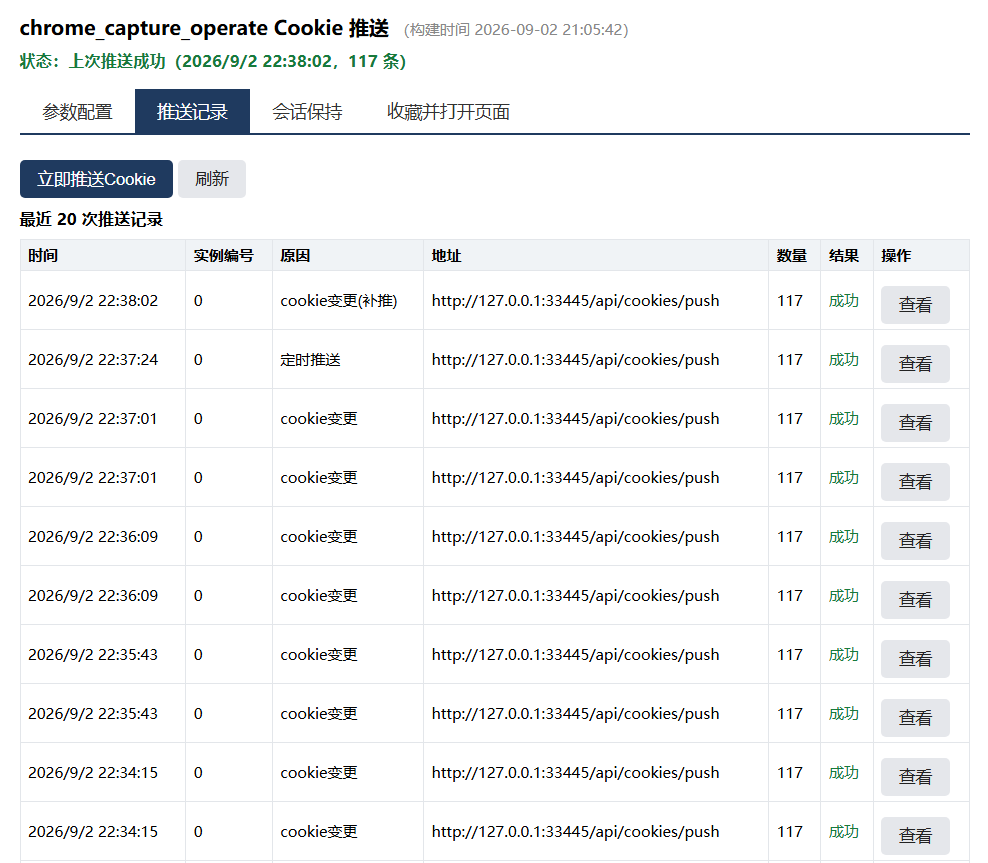

### 生成脚本-AI自主操作

假如需要由 AI 自主操作浏览器并生成脚本，则需要执行以下安装操作

#### 安装nodejs

从 nodejs 官网下载安装包并安装（建议 LTS 版本及以上）。

#### 安装chrome-devtools-mcp

```
npm install -g chrome-devtools-mcp
```

## 生成脚本的不同方式

|方式|前置条件|适合场景|
|---|---|---|
|AI自主分析页面生成脚本|需安装nodejs、chrome-devtools-mcp，并在AI Agent中配置MCP|页面操作内容多但AI能够理解（如筛选条件多），由AI完成以免人工逐项操作|
|人工操作AI生成脚本|无额外依赖，装好公共依赖即可|操作简单，人工能够快速完成；或包含多个步骤的操作AI不一定能自主完成|

两种方式产出的脚本效果相同，仅生成过程不同，可按任务灵活选择。

### 脚本生成结果

AI 在配置的保存目录下生成一个子目录，含四个文件：

- **Python脚本**（如 `main.py`）：生成的脚本本体，运行时通过 Python 服务获取登录态后发起请求
- **README.md**：说明脚本的作用与使用方法
- **baseline.md**：记录接口的数据来源契约（参数格式、可选值、分页与边界行为的实测结论），作为后续修改脚本的依据
- **prompt.md**：记录本次使用的完整提示词，便于追溯生成依据

## AI自主分析页面生成脚本

让 AI 完全自主操作 Chrome，完成“打开页面 → 操作 → 抓包 → 生成脚本”——人工只需补全提示词后交给 AI。

打开当前项目网页后，点击上方**AI自主操作Chrome**按钮，按弹窗中的说明分三步操作：

- **依赖环境准备**：安装 Chrome 浏览器、nodejs、chrome-devtools-mcp；点击弹窗中的**启动用于抓包的Chrome**（Chrome 已启动时该按钮变为**置顶用于抓包的Chrome进程**，点击可把窗口调到屏幕最前），在其中打开并登录需要生成脚本的网站

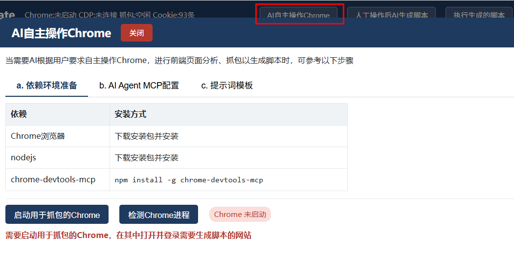

- **AI Agent MCP配置**：需要在使用的 AI Agent 中配置 MCP chrome-devtools-attach、chrome-operate。若使用 Claude Code，可在页面输入项目目录后点击**配置**按钮完成配置；若使用其他 AI Agent，则复制页面提供的提示词并执行，或修改为对应的MCP安装命令后执行


- **提示词模板**：编辑提示词（打开弹窗时模板已自动复制到剪贴板），补充需要 AI 在前端页面执行哪些操作、需要生成的 Python 脚本的具体要求，复制给 AI Agent 执行，等待 AI 分析并生成脚本；模板还包含操作留痕与验证要求——AI 操作页面期间逐个操作记录注释，写脚本前对关键假设直连实测验证

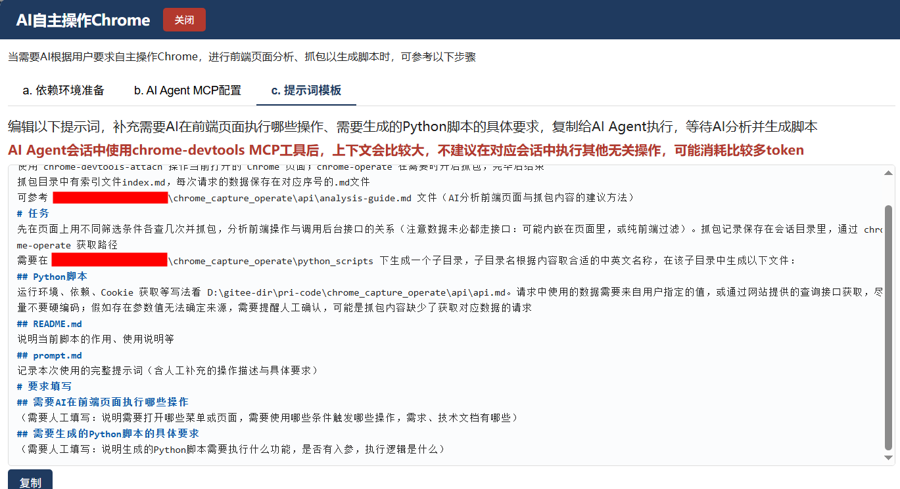

注意：AI Agent 使用 chrome-devtools-mcp 操作 Chrome 后上下文会比较大，建议该会话专用于本次生成脚本的任务，不用于其他操作，以节省 token。

## 人工操作AI生成脚本

本节完整步骤可随时点击页头**人工操作后AI生成脚本**按钮查看速查说明。

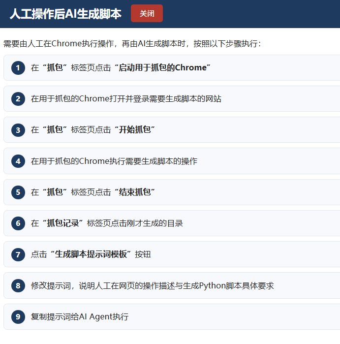

### 启动用于抓包的Chrome

在**抓包**标签页点击**启动用于抓包的Chrome**按钮：服务会启动一个新的 Chrome 实例，与日常使用的 Chrome 互不影响，**务必在新启动的 Chrome 中操作**——抓包只记录这个 Chrome。

Chrome 已启动时该按钮变为**置顶用于抓包的Chrome进程**，点击可把窗口调到屏幕最前；Chrome 退出后按钮自动恢复。

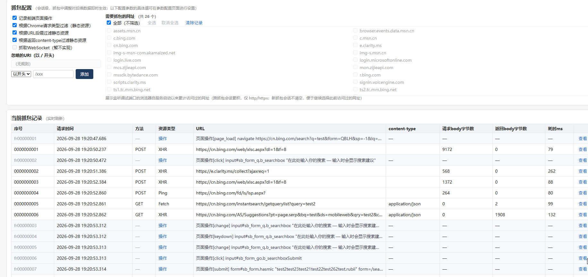

### 开始抓包并执行操作

1. 点击**开始抓包**：之后在该 Chrome 中的网络访问都会保存到抓包记录中
2. 在用于抓包的 Chrome 中打开目标网站，执行需要生成脚本的操作；建议从登录开始抓包，以避免重要操作被漏掉
3. 抓包配置可按需调整（会话级，对后续数据即时生效）：过滤开关（按请求类型/URL后缀/content-type过滤静态资源）、需要抓包的网址、忽略的URI、“记录前端页面操作”（向页面注入 DOM 事件监听，自动记录前端操作到操作注释时间线，默认开启，抓包中可随时开关、关闭后已记录的操作保留；记录哪些事件类型可在“参数配置”标签页选择，默认不记滚动/按下/聚焦等噪音与重复事件）
4. 开始抓包与结束抓包时，系统托盘图标会弹出气泡通知

点击下方的某条记录，可查看对应的网络数据

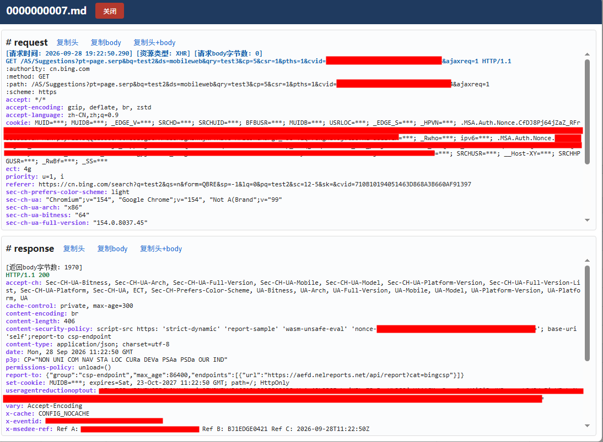

前端操作行（资源类型列显示“操作”，与请求记录混排、不同背景色）同样支持点击查看，详情含事件类型、触发来源（人工或程序合成）、目标元素、输入值等

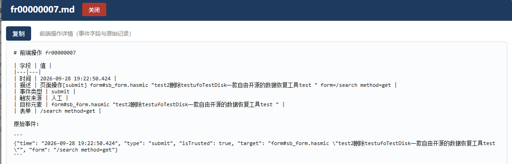

### 结束抓包并生成提示词

前置：需先在**快速执行脚本**标签页配置生成的脚本保存目录，否则点击**生成脚本提示词模板**按钮会提示先配置。

1. 点击**结束抓包**
2. 在**抓包记录**标签页选中刚才生成的目录，

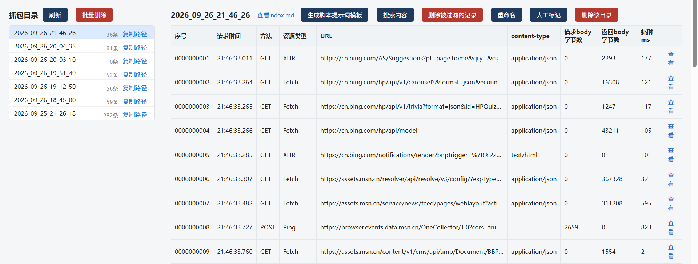

点击**生成脚本提示词模板**按钮

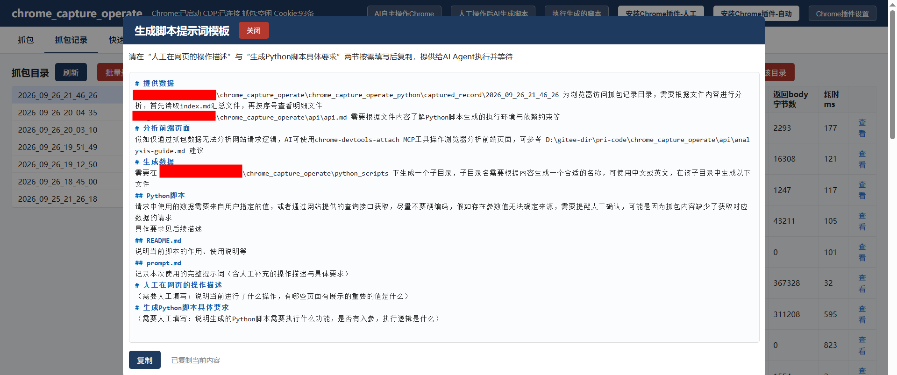

**必须人工补全**提示词中“人工在网页的操作描述”与“生成Python脚本具体要求”两节（进行了什么操作、脚本要执行什么功能），之后复制粘贴给 AI

提示词还包含操作留痕与验证要求引导：AI 用 chrome-devtools 操作页面时逐个操作记录注释，写脚本前对关键假设直连实测验证

点击某条记录时，可查看对应的网络数据

## 执行生成的脚本

### 快速执行

在**快速执行脚本**标签页左侧选择脚本子目录（示例目录与自定义目录下的脚本均可执行），右侧选择 `.py` 文件，点击**执行**；脚本输出实时展示在页面上，超过执行超时时间未完成会提示执行超时，可点击**结束进程**终止。

首次使用建议先执行示例目录的 `health_check` 脚本，验证从安装到执行的整条链路可用。

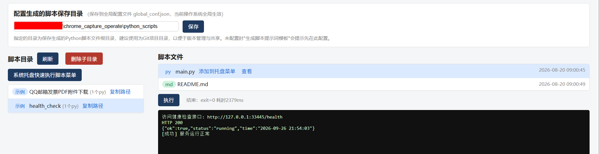

### 定时执行

在**定时执行脚本**标签页新增任务：选择一个生成的脚本，配置两种定时方式之一——**在指定时间执行**（每天 / 每周 / 每月 + 多个具体时间）或**每隔一段时间执行**（从指定时间开始，可配置允许执行的时间段）。

任务支持暂停 / 恢复 / 编辑 / 删除；每次执行生成独立日志，可在该页查看执行日志。

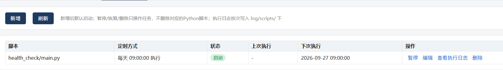

### 系统托盘执行

在**快速执行脚本**标签页选择目录，点击 `.py` 文件，点击**添加到托盘菜单**按钮，将常用脚本加入托盘菜单。点击“系统托盘快速执行脚本菜单”按钮后可以移除

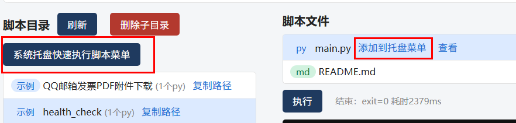

之后右键系统托盘图标 → 快速执行脚本 → 点击对应脚本，独立窗口实时展示脚本输出，执行完毕窗口保留显示退出码。

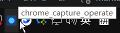

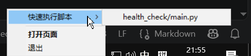

### 人工执行生成的Python脚本

可通过python命令执行

### AI Agent或其他程序执行

AI Agent 可通过 chrome-operate 的 MCP 工具执行生成的脚本并获取执行输出；也可由其他程序按同样方式调用。

## Chrome插件的其他功能

### 会话保持

长时间不访问目标网站时登录态会过期，定时执行的脚本可能返回未登录。插件定时刷新 Chrome 中已打开的对应页面，主动保持登录会话：在插件**会话保持**标签页配置，每项为域名或IP + 刷新间隔分钟。

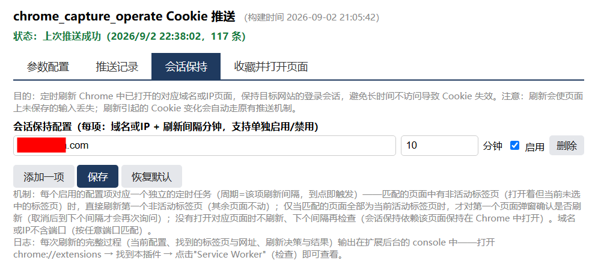

注意：刷新会使页面上未保存的输入丢失；会话保持依赖对应页面保持在 Chrome 中打开。

### 收藏并打开页面

浏览器中需要长期打开大量网页时，把当前打开的页面收藏为一条记录，之后一键批量打开——浏览器或系统重启后快速恢复整组页面。在插件**收藏并打开页面**标签页操作。

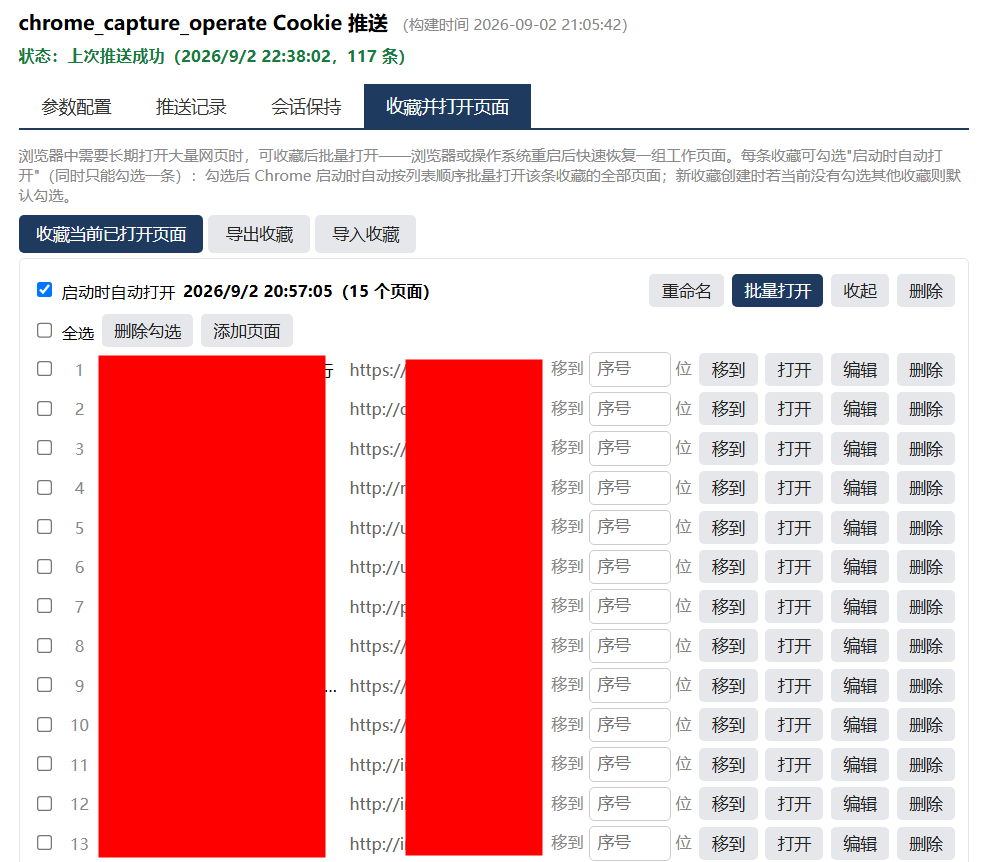

可导出或导入相关信息

### 配置导入导出

将插件全部配置导出为 `.json` 文件，或从 `.json` 导入，便于在新机器复制配置。在插件**参数配置**标签页操作。

## Chrome进程多开

同一网站需要登录多个账号时，为每个账号创建独立的 Chrome 实例分别登录，各实例数据互不干扰，脚本可按实例编号获取对应账号的登录态。在**Chrome进程多开**标签页点击**新增**，输入名称与本地数据存储目录；每个实例都要安装 Chrome 插件并填写实例编号。

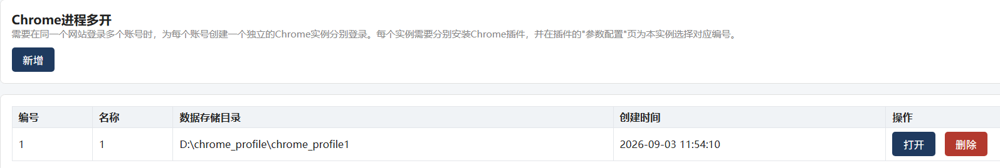

## Cookie 接收与查询记录

插件推送的 Cookie 是否到达 Python 服务、生成的脚本与 AI 的 Cookie 查询情况，均可在 Web 页面**Chrome Cookie接收与查询记录**标签页查看，页面提供两种展示：

- **接收记录**：内存中最近 50 次插件推送（时间、实例编号、原因、地址、数量、成功/失败）
- **查询记录**：当天最新 50 条 Cookie 查询留痕（时间、来源、查询地址、范围、数量、Authorization 有无、成功/失败），从日志文件读取、服务重启不丢

页面下方同时展示日志查看说明（含日志目录完整路径）：更早的完整记录见日志目录——查询记录见 cookie_query.log（每行一条 JSON、每天滚动），插件推送接收记录见按天生成的 yyyy-MM-dd.log 主日志；日志仅记数量与 key，不记录任何 Cookie/Authorization 值。

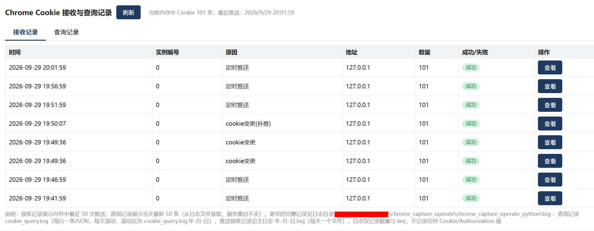

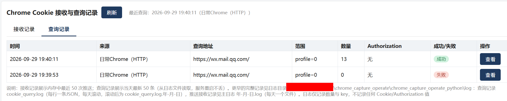

## 常见问题

|现象|排查|
|---|---|
|页面打不开 / 脚本获取 Cookie 报“服务不可达”|服务未启动——运行 start.bat 或检查系统托盘图标|
|插件未推送 Cookie|检查推送范围是否已从“全部禁止”修改为“全部允许”或按指定范围推送|
|脚本执行返回未登录或 401|推送范围 allow 清单需带 `*.` 通配符；登录态与插件须在同一个 Chrome 中；仍 401 多为会话过期——配置插件会话保持|
|抓不到部分请求|核对抓包配置的过滤开关与网址选择；仅记录 http/https 流量|
|开始抓包提示需先启动 Chrome|先点**启动用于抓包的Chrome**；已启动但检测不到时点**检测Chrome进程**刷新|
|用于抓包的Chrome窗口被其他窗口挡住|点**置顶用于抓包的Chrome进程**按钮调到最前|
|生成提示词时提示需配置脚本保存目录|在**快速执行脚本**标签页的**配置生成的脚本保存目录**填写并保存|
|脚本执行超时|执行超时时间可在**参数配置**标签页调整；或检查脚本是否在等待交互输入|
|定时任务到点未执行|确认任务未被暂停、Python 服务当时正在运行；服务重启后任务自动恢复，期间错过的调度只补执行最近一次|
|抓包记录中没有页面操作注释|确认抓包配置中“记录前端页面操作”已勾选（默认开启）；确认操作发生在用于抓包的 Chrome 中（日常 Chrome 的操作不会记录）|
|操作记录中没有滚动/按下/聚焦事件|默认不记录这三类（与点击重复或纯噪音）；需要时在“参数配置”标签页的“前端操作记录事件类型”中勾选|
|页面操作注释显示“（合成）”|该操作由程序（AI/脚本）触发而非人工点击，标注用于区分操作来源，不影响分析|

通过模拟点击安装 Chrome 插件失败：需日常 Chrome 已运行且界面语言为中文；通过注册表安装需人工点击 UAC 确认框。

# 场景示例

- **QQ邮箱发票PDF附件下载**：自动搜索收件箱中含“发票”的邮件，批量下载其中的 PDF 附件到本地（示例脚本随项目分发，可按「使用说明」章的流程对自己的网站生成类似脚本；生成过程中人工搜索、翻页、下载等页面操作自动留痕，AI 直接从时间线获取操作序列与参数值）
- **火车票不同条件查询**：按出发/到达站、日期、车型等不同条件查询火车票网站的余票信息

注意：文档中的场景示例仅用于演示工具的功能与用法，不能用于任何非法用途，或对网站进行攻击、恶意请求等操作；实际使用须遵守目标网站的服务条款与相关法律法规。

# 安全性

本工具处理 Cookie、Authorization 等登录态敏感数据，安全性设计如下。

## Cookie 推送范围

- 插件安装后默认为“全部禁止”——不向 Python 服务推送任何 Cookie 与 Authorization，须人工在插件**参数配置**标签页显式改为“全部允许”或“按指定范围推送”；范围外的网站数据不会离开浏览器
- 推送到 Python 服务的 Cookie 仅存内存、不写入文件，服务重启即清空

## 接口访问范围

- Python 服务的全部接口（Web 页面、Cookie 查询、AI Agent 调用的 MCP 服务）仅监听本机地址（127.0.0.1），局域网内其他电脑无法访问
- 接口不设访问令牌，安全边界即本机——本机登录用户下的程序均可调用
- 网页可修改的插件配置限定为推送范围等白名单字段，推送目标地址不开放网页修改——本机上的任意网页无法把 Cookie 重定向到其他地址

## Cookie 查询留痕

- 所有 Cookie 查询（生成的脚本、AI Agent 等发起的调用）逐次留痕到独立日志文件 `chrome_capture_operate_python/log/cookie_query.log`（每行一条 JSON 结构化记录，每天滚动、不自动删除）；只记录时间、来源、查询地址、返回数量与 key，不记录任何 Cookie/Authorization 值
- 日常查看：Web 页面**Chrome Cookie接收与查询记录**标签页供快速查看——查询记录展示当天最新 50 条（从日志文件读取，服务重启不丢），插件推送接收记录展示内存中最近 50 次；更早的记录在日志文件中完整保存——查询见 cookie_query.log，插件推送接收见按天生成的 `log/yyyy-MM-dd.log`

## 抓包与日志脱敏

- 抓包明细文件中的 Cookie、Authorization 值均掩码为 `***`（key 保留），抓包数据可安全交给 AI 分析；自动记录前端操作时，密码输入框的值自动掩码
- 程序日志同样只记 Cookie 的数量与 key；需要真实登录态验证时经接口在内存中读取，不写入文件

## 数据不出本机

抓包文件、Cookie、日志全部保存在本机，工具自身不向任何外部服务器发送数据；生成的脚本只在本机与目标网站之间通信。
